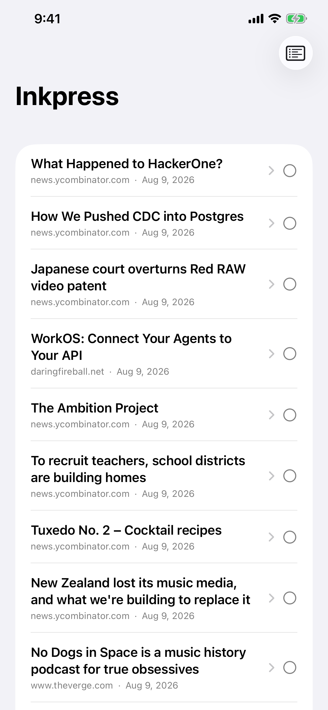
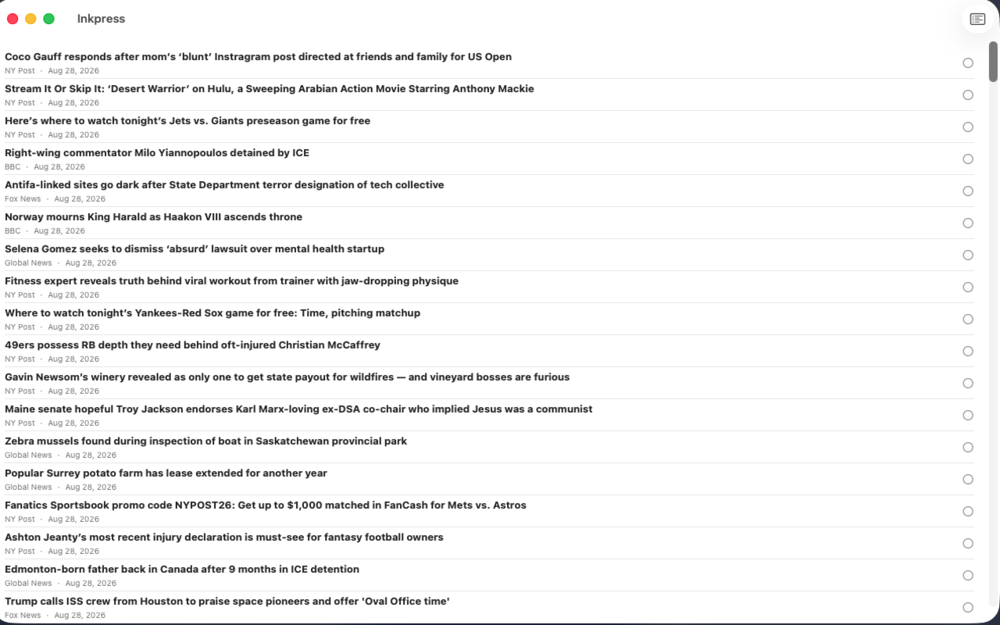
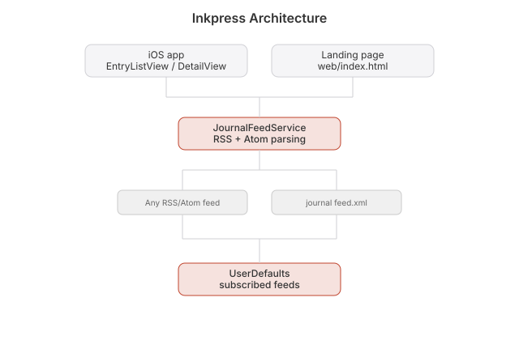

# Inkpress

  [](https://github.com/nulljosh/inkpress)

All your feeds, one timeline. An RSS and Atom reader for iOS, macOS, and Apple Watch.

Add any feed. Read everything in one stream, newest first.

Live on the [App Store](https://apps.apple.com/app/id6787759999). Landing page at [inkpress.heyitsmejosh.com](https://inkpress.heyitsmejosh.com).

<p>
  
  
</p>

This repo split from `journal` on 2026-07-21 and now holds only the iOS app. The blog
lives at [github.com/nulljosh/journal](https://github.com/nulljosh/journal). Inkpress
subscribes to its `feed.xml` by default, like any other feed. No code is shared.

## Features
- Add or remove any RSS or Atom feed
- One timeline across every subscription, newest first
- Manage feeds one by one (`ManageFeedsView`)
- Starts with one feed so it isn't empty (`FeedStore.defaultFeed`). Remove it if you like

## Run
```bash
cd ios
xcodegen generate
xcodebuild -scheme Inkpress -destination 'generic/platform=iOS Simulator' build
```

## Apple Watch

A standalone watchOS companion lives in `watchos/` (sibling to `ios/`, its own
target, `WKWatchOnly`, no iOS host app pairing). It shows the latest entries from
your journal feed (defaults to `journal.heyitsmejosh.com/feed.xml`, same as
`FeedStore.seedFeeds[0]` on iOS), with the same upvote toggle as the iOS list, plus
a Settings tab to paste an API token for a future personal API (nothing to
authenticate against yet — entries load from public feeds without one).

```bash
cd watchos
xcodegen generate
xcodebuild -project InkpressWatch.xcodeproj -scheme InkpressWatch \
  -destination 'generic/platform=watchOS' build
```

## Landing page

A static site in `web/`: `index.html`, `privacy.html` and `support.html`. The last
two are meant to be the App Store privacy and support URLs. App Store Connect
still points both at the blog, see `roadmap.md`. No build step. The three pages
share `web/style.css`.

Preview locally:

```bash
cd web && python3 -m http.server 8000
```

Deploys to Cloudflare Pages from `main` whenever `web/` changes, through
`.github/workflows/deploy-web.yml`. `scripts/check-links.py` runs first, so a
broken link fails the build instead of shipping. Needs the repo secrets
`CLOUDFLARE_API_TOKEN` and `CLOUDFLARE_ACCOUNT_ID`. The custom domain was
attached once, in the Cloudflare dashboard.

## Roadmap
- [ ] Splash screen (needs a design asset, not just code)
- [ ] Sync subscriptions across devices. Needs accounts. Not started, no need yet

## License
MIT 2026 Joshua Trommel

## Whitepaper

[Technical whitepaper](WHITEPAPER.md)

## Architecture


